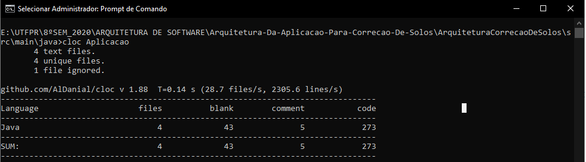
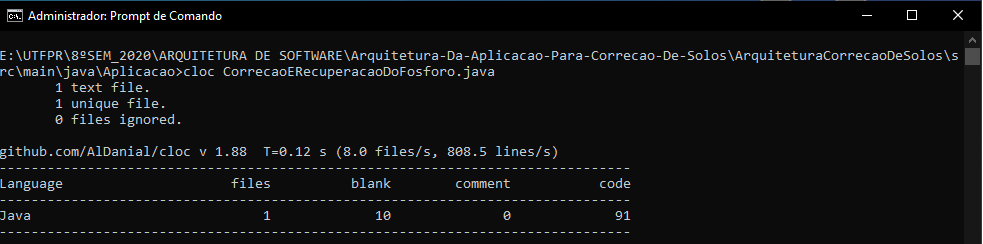
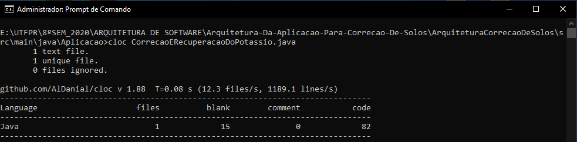
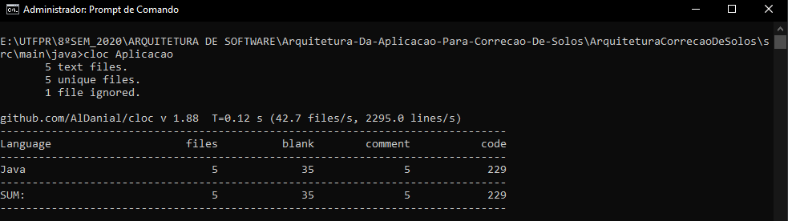
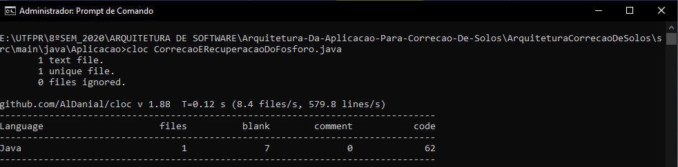
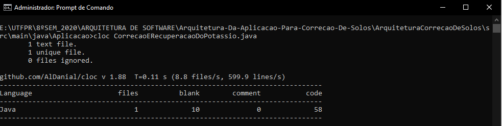

# Arquitetura Da Aplicação Para Correção De Solos

Projeto demandado pelo IDR-Paraná, que visa desenvolver a Arquitetura da aplicação para correção de solos. O objetivo principal é identificar cada componente que precisa ser aplicado no solo de acordo com o seu estado atual. Este projeto é orientado pelo Professor Dr. Gabriel Costa Silva para a disciplina de Arquitetura de Software e será desenvolvido na linguagem de programação Java.

 
### RELATÓRIO DE AJUSTES NO CÓDIGO
1. Código do projeto antes das mudanças
      <section> 
        
 * PROJETO 

        
      </section>
      <section> 
       
 * CLASSE RECUPERACAO E CORRECAO DO FÓSFORO 

        
      </section>
      <section> 
        
 * CLASSE RECUPERACAO E CORRECAO DO POTÁSSIO 

        
      </section>

2. Problemas identificados
      <section>
        
 * Condicionais repetidas 

        
 * Estrutura do switch defasada e extensa 

        
 * Métodos construturoes inviáveis

        
 * Variáveis constantes sem a utlização de Enum 

      </section>
        
3. Soluções encontradas
     <section>
       
 * Unificar as condionais repetidas 

       
 * Atualizar a estrutura do switch 

       
 * Criar uma classe Enum para diminuir a extensão dos switch 

       
 * Remover os métodos construturoes da classe 

     </section>
     
4. Referências dos commits
   <section> 
      * <a href="https://github.com/LeonardoSMateus/Arquitetura-Da-Aplicacao-Para-Correcao-De-Solos/commit/e98851f88fe814204cd09af1bcd0690f40e12ab3"> Modificações na Classe Correção e Recuperação Do Fósforo </a>
       
      * <a href="https://github.com/LeonardoSMateus/Arquitetura-Da-Aplicacao-Para-Correcao-De-Solos/commit/972e8609f20ce55bda6f119334fc942ba9f17ba7"> Modificações na Classe Correção e Recuperação Do Potássio </a>
   </section>
   
5. Código do projeto depois das mudanças
 
      <section> 
        
 * PROJETO 

        
      </section>
      <section> 
        
 * CLASSE RECUPERACAO E CORRECAO DO FÓSFORO 

        
      </section>
      <section> 
        
 * CLASSE RECUPERACAO E CORRECAO DO POTÁSSIO 

        
      </section>

     # Relatório - Atividade #4
A atividade teve como objetivo criar três testes que simulam os quadros de teores do solo, correção/recuperação de fósforo, e correção/recuperação de potássio.
Abaixo serão destacados os problemas e as devidas soluções encontradas para cada caso, seguidos de seus commits. E também uma breve análise do código como um todo.

<ul>
       <li>
 <b>Dificuldades/problemas encontrados: </b></li>
              1- Ao clonar o repositório e rodar a implementação, a mesma não compilou, aparecia a seguinte mensagem de erro:   
<pre>
Plugin org.apache.maven.plugins:maven-surefire-plugin:2.10 or one of its dependencies could not be resolved: Failed to read artifact descriptor for org.apache.maven.plugins:maven-surefire-plugin:jar:2.10: Failure to transfer org.apache.maven.plugins:maven-surefire-plugin:pom:2.10 from http://repo.maven.apache.org/maven2 was cached in the local repository, resolution will not be reattempted until the update interval of central has elapsed or updates are forced. Original error: Could not transfer artifact org.apache.maven.plugins:maven-surefire-plugin:pom:2.10 from/to central (http://repo.maven.apache.org/maven2): Failed to transfer file: http://repo.maven.apache.org/maven2/org/apache/maven/plugins/maven-surefire-plugin/2.10/maven-surefire-plugin-2.10.pom. Return code is: 501 , ReasonPhrase:HTTPS Required. -> [Help 1]

</pre>
              Aparentemente, havia algum problema na criação do maven do projeto, a solução utilizada para esse caso, foi adicionar alguns plugins no arquivo <i>pom.xml</i> para fazer o código funcionar - <a href="https://github.com/Caioiwamoto/Arquitetura-Da-Aplicacao-Para-Correcao-De-Solos/commit/01972bb8d14852628618cb9b308485d05f81ce75">commit</a>.    
              2- O código apresentou alguns testes com falhas, na verdade havia um problema de expressões ilegais nos métodos de switch case, o que ocasionava em valores inválidos para a realização dos testes, a solução foi trocar as "->" por ":" nessas funções - <a href="https://github.com/Caioiwamoto/Arquitetura-Da-Aplicacao-Para-Correcao-De-Solos/commit/6a78a01fc0f460ba0f6188828cd065d70bd63368">commit</a>.   
              3- Estava faltando realizar os testes dos cálculos de custo do alqueire para cada fonte de fósforo. Os testes faltantes foram implementados separadamente e podem ser vistos no arquivo realizado para esta atividade <i>Tests.java</i>- <a href="https://github.com/Caioiwamoto/Arquitetura-Da-Aplicacao-Para-Correcao-De-Solos/commit/6a78a01fc0f460ba0f6188828cd065d70bd63368">commit</a>. 
        <li>
 <b>Análise do código: </b></li>
              1- Analisando o código é perceptível que existem muitas estruturas condicionais no formato de switch case e if/else, como visto em aula, essa quantidade de métodos pode deixar o código mais organizado, mas prejudica a manutenabilidade.   
              2- O código analisado não possui nenhuma herança, um dos pilares da orientação a objetos. Seria interessante a utilização, pois assim melhoraria a complexidade e o entendimento do mesmo.
           

</ul>  

